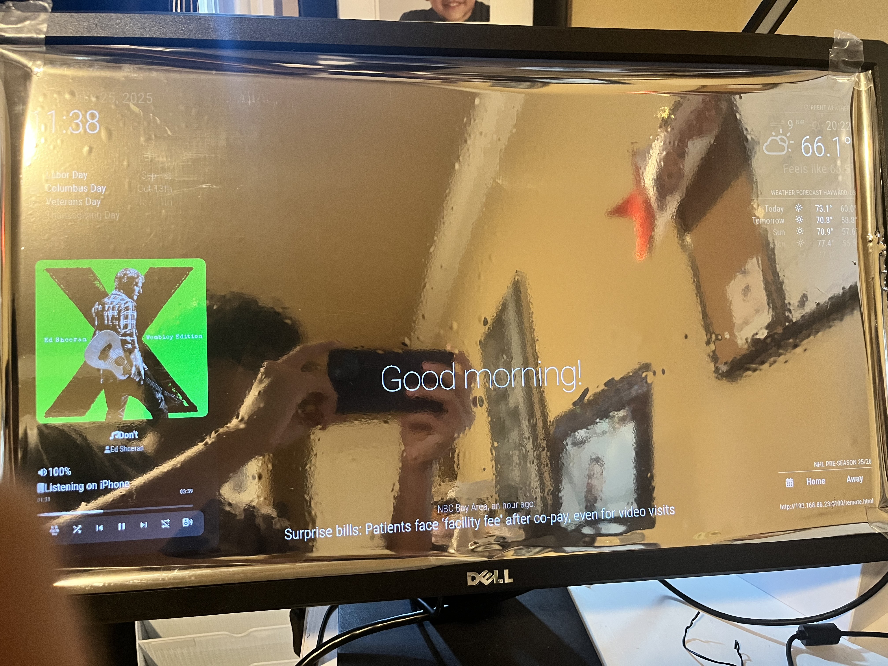
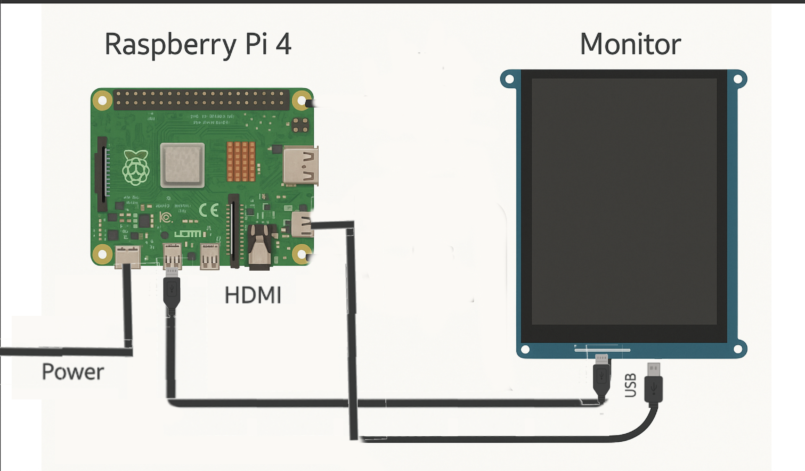

# Magic Mirror Project
This project is a smart mirror that shows my calendar, weather, news, and even music info all in one place. I also added an integration of Google Assistant, allowing me to use custom voice commands such as switching between pages, which was the trickiest part of the whole project. Now it’s super handy and makes checking my day way easier.

| **Engineer** | **School** | **Area of Interest** | **Grade** |
|:--:|:--:|:--:|:--:|
| Noah N | Moreau Catholic High School | Computer Engineering | Incoming Sophmore


  
# Final Milestone

<iframe width="560" height="315" src="https://www.youtube.com/embed/BTEM8XvteKc?si=AXeX_nQJUru3l6vG" title="YouTube video player" frameborder="0" allow="accelerometer; autoplay; clipboard-write; encrypted-media; gyroscope; picture-in-picture; web-share" referrerpolicy="strict-origin-when-cross-origin" allowfullscreen></iframe>


Since my second milestone I've made one big modification, which was the Google Home modification. Now I can create custom voice commands and execute them through my Google Home doing things such as hiding modules and turning on and off the screen. I did this by using something called home assistant, home assistant is something you can install on your pi and you can create custom switches that run commands for you on a website. Although, home assistant isn't enough by itself so I used something called nabu casa which is used in sync with home assistant and essentially exposes the commands to the internet allowing the Google Home to find and use them. I also added a pages module so that you can add even more modules, and on the second page I added a google calendar so you could see all the upcoming events. With the addition of the pages module I added a custom command allowing you to switch through the pages by saying "Hey google, Turn on Page 2." 

This was by far my biggest challenge and triump during my time at BSE, It took me over a week through researching ways to do it, trial and error, and coding the commands, but it ended up all being worth it. I learned alot of things in hardware and software, in hardware I learned how to do simple things such as just setting up the pi. I learned alot more on the software side though as one example is learning how to ssh into visual code. I also learned how to work with github and learned alot about remote commands.


# Second Milestone

<iframe width="560" height="315" src="https://www.youtube.com/embed/2LTlhNodHtc?si=-czZWU8tEoXDfSN1" title="YouTube video player" frameborder="0" allow="accelerometer; autoplay; clipboard-write; encrypted-media; gyroscope; picture-in-picture; web-share" referrerpolicy="strict-origin-when-cross-origin" allowfullscreen></iframe>

For my milestone 2, on the technical side, I customized the modules by setting the weather to my location and changing the news feed to cycle between The New York Times and NBC Bay Area news. I also added two new modules, Spotify and the NHL module. The NHL module was very easy to set up and took almost no effort, but the Spotify module gave me a bit of a headache. The main issue was with authorization, at first I tried using the MMM-OnSpotify module, but the authorization kept failing and redirecting me. In the end, I solved the problem by switching to a different module called MMM-Spotify and completing the setup directly on my Pi.

On the hardware side, I upgraded to a new monitor, which required two additional parts. One was an HDMI-to-DVI-D cable since my monitor only accepts DVI-D, and the other was a reflective film placed on top so the screen would look like a mirror.

For my future milestones, I plan to make one more major customization by connecting the MagicMirror to my Google Home for custom voice commands. I also want to build/find a frame for the mirror and fix the air bubble issues on the reflective film.

# First Milestone

<iframe width="560" height="315" src="https://www.youtube.com/embed/3US5norbM2o?si=PqMy66vXGKCBMSYp" title="YouTube video player" frameborder="0" allow="accelerometer; autoplay; clipboard-write; encrypted-media; gyroscope; picture-in-picture; web-share" referrerpolicy="strict-origin-when-cross-origin" allowfullscreen></iframe>

For my first milestone, I set up my Raspberry Pi by connecting the SD card to my computer with an SD card reader to flash the necessary OS. Once I did that, I moved on to the wiring aspect, which was fairly easy, there was only a power cable for the Pi, a USB and HDMI cable for the monitor, and two additional USB ports for the keyboard and mouse. Although, one challenge I ran into was SSHing into the Pi through Visual Studio Code. The problem was with the virtual machine but I eventually found an alternative method that worked.

After figuring that out ,I installed the MagicMirror2 software on the Pi. At this point, the monitor now displays all the default modules, such as the clock, calendar, and weather.

For my next milestones, I’m planning to add even more modules such as a Spotify integration, and customizing existing ones, such as configuring the weather module to where I live. 


# Schematics 


# Code
Here is some of my code from my Google Home setup, and here is a link where you can see the main changes of my [modules.](https://github.com/NoahNewman44/MagicMirrorCode/tree/main/Code)

```python
//Home Assistant commands
shell_command:
  magicmirror_page_1: 'curl "http://192.168.86.23:8100/remote?action=NOTIFICATION&notification=PAGE_CHANGED&payload=0"'
  magicmirror_page_2: 'curl "http://192.168.86.23:8100/remote?action=NOTIFICATION&notification=PAGE_CHANGED&payload=1"'
  magicmirror_next_page: 'curl "http://192.168.86.23:8100/remote?action=NOTIFICATION&notification=PAGE_INCREMENT"'
  magicmirror_monitor_off: 'curl "http://192.168.86.23:8100/remote?action=MONITOROFF"'
  magicmirror_monitor_on: 'curl "http://192.168.86.23:8100/remote?action=MONITORON"'
//Automations
- id: monitor_off_automation
  alias: Monitor Off
  description: Turn monitor off when helper is toggled off
  trigger:
  - platform: state
    entity_id: input_boolean.monitor_power
    to: 'off'
  condition: []
  action:
  - service: shell_command.magicmirror_monitor_off
  mode: single
- id: '1753293914842'
  alias: Monitor On
  description: ''
  trigger:
  - platform: state
    entity_id: input_boolean.monitor_power
    to: 'on'
  condition: []
  action:
  - service: shell_command.magicmirror_monitor_on
  mode: single
- alias: Mirror - Switch to Page 1
  trigger:
  - platform: state
    entity_id: input_select.mirror_pages
    to: Page 1
  action:
  - service: shell_command.magicmirror_page_1
  mode: single
  id: 1bb5fb9681204d62bcc03dcd5f373010
- alias: Mirror - Switch to Page 2
  trigger:
  - platform: state
    entity_id: input_select.mirror_pages
    to: Page 2
  action:
  - service: shell_command.magicmirror_page_2
  mode: single
  id: 11dfbe0c2fbf4aa8a49358663c170113
- id: '1753384536663'
  alias: Page 2
  description: ''
  triggers:
  - trigger: state
    entity_id:
    - input_button.page_2
  conditions: []
  actions:
  - action: shell_command.magicmirror_page_2
    metadata: {}
    data: {}
  mode: single
- id: '1753384666182'
  alias: Page 1
  description: ''
  triggers:
  - trigger: state
    entity_id:
    - input_button.page_1
  conditions: []
  actions:
  - action: shell_command.magicmirror_page_1
    metadata: {}
    data: {}
  mode: single

```

# Bill of Materials
Here's where you'll list the parts in your project. To add more rows, just copy and paste the example rows below.
Don't forget to place the link of where to buy each component inside the quotation marks in the corresponding row after href =. Follow the guide [here]([url](https://www.markdownguide.org/extended-syntax/)) to learn how to customize this to your project needs. 

| **Part** | **Note** | **Price** | **Link** |
|:--:|:--:|:--:|:--:|
| Raspberry Pi 4 Starter Kit | Brains of the project, used to run and execute the code. | 91.99$ | <a href="https://www.amazon.com/RasTech-Raspberry-Starter-Heatsink-Screwdriver/dp/B0C8LV6VNZ/ref=sr_1_4?crid=3506HY00MCGVM&dib=eyJ2IjoiMSJ9._zkM62vSQ8p7tNr88715LdMv_qHh72Je-tkF9PXEa3chDE53QT4aZu4AGAb4ihE61QY4ZD55nKF6Fp2Kfs8t7AbafM_JrlJFfHo9OB4eAVGqa0EB-7aoBQHPmhKHZ2MW8ny-Kd44bMVlVxPlTWVk5YHIN5P3uKVqrE5Dcal0rKkHny-O6Xyb5ux2AOU6OwVbkag_bqBX66RQNRrgBuz-0pS43mcx93IZTQA9R8NaJJypYU2HAycp-XicTFmyU60a01Nfm9iuyo6B9yA8ppN3OQQyJ-NQ9xyNPxfTLwkqtng.yAYpU6outhQcZmOZhN9Wb6yTw7A85CNUbXZguGInZNg&dib_tag=se&keywords=raspberry%2Bpi%2Bkit&qid=1718848547&s=electronics&sprefix=rasbperry%2Bpi%2Bkit%2Celectronics%2C83&sr=1-4&th=1"> Link </a> |
| Dell E2314H Monitor | Used to display the code. | 47.79$ | <a href="https://www.pcliquidations.com/p64773-dell-e2314hf-23-fhd?variant=85229&gad_source=1&gad_campaignid=649733014&gbraid=0AAAAAD_tUvdfrKg0msY5ZBajmJg2ZvVFY&gclid=CjwKCAjw1ozEBhAdEiwAn9qbzW5qbEnjreyRlCgAYd1zTX9p0xvop7TJ8eJH04CHFE1mMX6EjTzFcxoCbqsQAvD_BwE)"> Link </a> |
| SD Card Adapted | Used to download code onto SD card from my laptop. | 7.99$ | <a href="https://www.amazon.com/dp/B081VHSB2V?ref=ppx_yo2ov_dt_b_fed_asin_title&th=1"> Link </a> |
| Keyboard and Mouse | Used to put in inputs for pi instead of just touchscreen | 21.99$ | <a href="https://www.amazon.com/gp/product/B07XDWCLYF/ref=ppx_yo_dt_b_search_asin_title?ie=UTF8&psc=1"> Link </a> |
| Reflective Film | Used on the monitor to turn it into a reflective mirror-like surface. | 4/99$ | <a href="https://www.amazon.com/dp/B0998PYXSH?ref_=ppx_hzsearch_conn_dt_b_fed_asin_title_1"> Link </a> |
| HDMI to DVI-D | Used to connect my raspberry pi to the monitor.| 5.68$ | <a href="https://www.amazon.com/DTECH-Female-Adapter-Bi-Directional-Converter/dp/B07MJDYH21/ref=sr_1_5?crid=3V9A8DCCTS3P0&dib=eyJ2IjoiMSJ9.VaMbzXVXmZIRq1rTwzIL672mK8lbpK8vf4u6hf3YLFxZc7jWfjMB-zBX04fK80-niwao6vSzw_5_QqS69uPFNA0mqVg7P4Kk7-X05jKbR8ma3UKvfJTqrm6Ynsi-oM8DtZaYYc-p4Xpw_3cwKFSe6laOytUkh0WtL5ba29PRgrnMiZcNfRSXJF5_beU1a9l1WmWHcOhmUDoIxxB6z1SU9EfpN_wiUpXNb-Xf0DiDzYc.3uJLI0VEXxcGFBYCpHmiZwm5ImklQVVYGPFK3GW0gaA&dib_tag=se&keywords=dvi+to+hdmi+adapter&qid=1752515951&sprefix=dvid+to+%2Caps%2C280&sr=8-5"> Link </a> |


# Resources Used
- [Github Modules](https://github.com/MagicMirrorOrg/MagicMirror/wiki/3rd-party-modules)
    - [Spotify Module](https://github.com/skuethe/MMM-Spotify)
    - [NHL Module](https://github.com/parnic/MMM-NHL)
    - [Remote Control](https://github.com/Jopyth/MMM-Remote-Control)
    - [Pages Module](https://github.com/edward-shen/MMM-pages)


Also used resources such as ChatGPT and Claude for researching different ways of implementing ideas. Used Home Assistant for my Google Home setup aswell.
